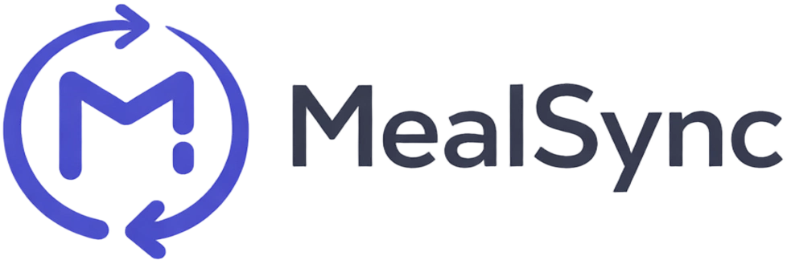

<p align="center">
  
</p>

<h1 align="center">MealSync</h1>

<p align="center">
  <strong>Automated meal booking for Al-Zahraa Dormitories Management Portal</strong>
</p>

> **⚠️ Windows only** — MealSync is built exclusively for Windows. macOS and Linux are not supported.

<p align="center">
  <a href="https://github.com/yousef-ehabb/MealSync/releases/latest">
    
  </a>
  <a href="https://github.com/yousef-ehabb/MealSync/blob/main/LICENSE">
    
  </a>
  
  
</p>

---

## ✨ Features

- **One-Click Booking** — Book all available meals with a single click
- **Auto-Booking Scheduler** — Set a daily time and MealSync books for you automatically
- **Meal Report** — View your received vs. missed meals with a clear summary
- **Booking History** — Full history of all past bookings with status tracking
- **System Tray** — Runs silently in the background, always ready
- **Native Notifications** — Get notified when bookings succeed or fail
- **Encrypted Credentials** — Your password is encrypted using machine-specific keys
- **Retry Logic** — Automatically retries on network failure (up to 3 attempts)
- **Start with Windows** — Optionally launch at system startup

## 📥 Download & Install

> **No coding required.** Just download and run.

1. Go to the [**Latest Release**](https://github.com/yousef-ehabb/MealSync/releases/latest)
2. Download **`MealSync Setup 1.1.0.exe`**
3. Run the installer and follow the prompts
4. Launch MealSync and enter your Student ID & Password
5. That's it — your meals will be booked automatically!

## ⚙️ Configuration

### Timezone

> **Important:** MealSync is hardcoded to the `Africa/Cairo` timezone (UTC+2, no DST). All scheduling times are in Cairo local time. If you are not in Egypt, your scheduled booking time will be offset by your timezone difference.

### Debug Mode

When enabled, the Playwright automation browser runs in a visible window instead of headless. Useful for diagnosing portal login issues. Disable for normal use.

## 🛠️ Tech Stack

| Layer | Technology |
|-------|-----------|
| **Framework** | Electron 40 |
| **Frontend** | React 18 + Vanilla CSS |
| **Build** | Vite 7 + electron-builder |
| **Automation** | Playwright |
| **Scheduling** | node-cron |
| **Security** | AES-256-GCM encryption (machine-bound) |

## 🧑‍💻 Developer Setup

```bash
# Clone the repository
git clone https://github.com/yousef-ehabb/MealSync.git
cd MealSync

# Install dependencies
npm install

# Install Playwright browsers
npx playwright install chromium

# Run in development mode
npm run dev

# Build for Windows
npm run build:win
```

See [CONTRIBUTING.md](CONTRIBUTING.md) for detailed contribution guidelines.

## 🏗️ Building for Production

Before building, ensure Playwright's Chromium is installed and the bundle is generated:

```bash
npx playwright install chromium
npm run build:win
```

The `prebuild` script automatically copies Chromium (~150MB) into `chromium-bundle/` which is then bundled into the installer. The installer will be generated in `dist-setup/`.

## 📁 Project Structure

```
MealSync/
├── electron/          # Main process (Electron)
│   ├── main.js        # App entry, IPC handlers
│   ├── booking.js     # Booking automation (Playwright)
│   ├── portalReportService.js  # Meal report scraper
│   ├── scheduler.js   # Cron-based auto-booking
│   ├── encryption.js  # AES-256-GCM credential encryption
│   ├── tray.js        # System tray management
│   └── preload.cjs    # Context bridge (IPC)
├── src/               # Renderer process (React)
│   ├── pages/         # Dashboard, History, Settings, Onboarding
│   ├── styles/        # CSS styles
│   ├── App.jsx        # Main app component + routing
│   └── main.jsx       # React entry point
├── assets/            # App icons and images
└── tests/              # Unit and E2E tests
```

## 📄 License

This project is licensed under the [ISC License](LICENSE).

---

<p align="center">
  <em>Built with ❤️ by <a href="https://github.com/yousef-ehabb">Yousef Ehab</a></em>
</p>
<p align="center">
  <em>Please remember my mother in your prayers.</em>
</p>
